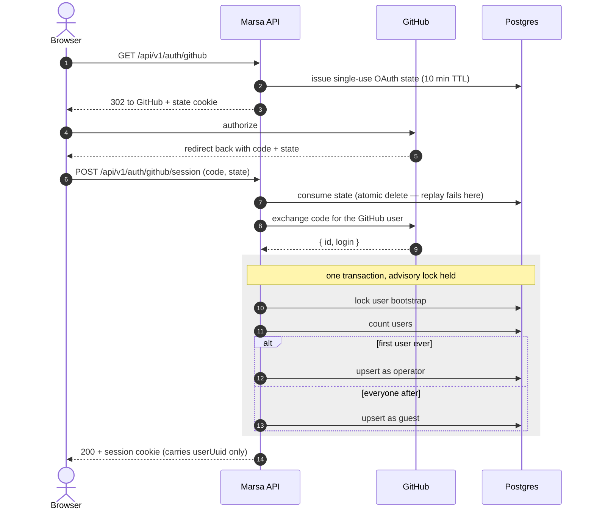
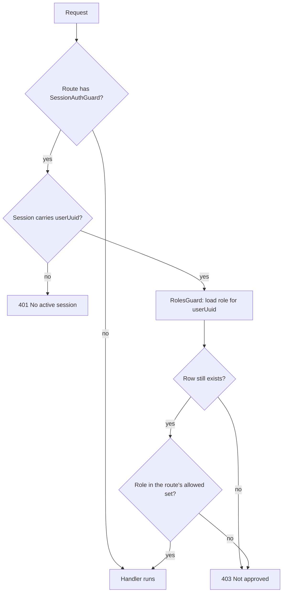

# Authentication and authorization

Marsa answers two separate questions on every request:

1. **Who are you?** — `SessionAuthGuard`, opt-in per route.
2. **Are you allowed?** — `RolesGuard`, applied globally.

They are independent. A route can have neither, either, or both, and the combination decides
what an unapproved user sees.

## The two guards

|                    | `SessionAuthGuard`                          | `RolesGuard`                                       |
| ------------------ | ------------------------------------------- | -------------------------------------------------- |
| Registered         | Per route, `@UseGuards(SessionAuthGuard)`   | Globally, via `APP_GUARD` in `AccessControlModule` |
| Needs a decorator? | **Yes** — it does nothing unless you add it | **No** — it runs on every route already            |
| No session present | 401                                         | Passes through                                     |
| Session present    | Passes through                              | 403 unless the role is admitted                    |

The asymmetry is deliberate. `RolesGuard` cannot reject an anonymous request, because plenty
of routes are meant to be anonymous (`GET /auth/github` starts the login). What it can do is
guarantee that a route added later is **closed by default**: forget to decorate a new
endpoint and a Guest still cannot reach it.

`AccessControlModule` is imported by `AppModule.forRoot`, not `AuthModule`, so the gate also
covers `TestBench.setupModuleTest`, which boots a single feature without `AuthModule`.

## Roles

| Role       | Means                       | Reaches                                            |
| ---------- | --------------------------- | -------------------------------------------------- |
| `operator` | Administers the install     | Everything, including `/v1/users` and role changes |
| `member`   | Approved user               | Everything except the operator-only surface        |
| `guest`    | Signed in, not yet approved | Only `GET /auth/me`                                |

The **first** user row ever created becomes `operator` (under an advisory lock, so two
simultaneous first logins cannot both claim it). Every later sign-in lands on `guest` and
reaches nothing until an operator promotes them.

The role is read from the database **per request**, not stamped into the session cookie, so
a promotion takes effect on the promoted user's next request rather than their next login.

## Decorating a route

```ts
@Get()
@UseGuards(SessionAuthGuard)   // 401 without a session
@Roles(UserRole.Operator)      // narrower: operators only
handle() {}
```

| You want                               | Write                                                        |
| -------------------------------------- | ------------------------------------------------------------ |
| Anonymous access                       | Nothing — no `@UseGuards`, no role decorator                 |
| Any approved user (operator or member) | `@UseGuards(SessionAuthGuard)`                               |
| Operators only                         | `@UseGuards(SessionAuthGuard)` + `@Roles(UserRole.Operator)` |
| Reachable by a not-yet-approved user   | `@UseGuards(SessionAuthGuard)` + `@AllowGuest()`             |

`@AllowGuest()` exists for exactly one route today: `GET /auth/me`. A guest has to be able to
read its own role, or the dashboard cannot tell them _why_ they are blocked and they just see
a wall of 403s. Adding a second one should need an argument.

## Logging in



The session cookie is a `@fastify/secure-session` cookie and carries **only** `userUuid` —
never the role. That is what makes a promotion take effect without a re-login.

## Authorizing a request



The allowed set is `@Roles(...)` if present, `@AllowGuest()`'s widened set if present, and
otherwise the default `operator | member`.

Note the ordering consequence: `RolesGuard` runs globally, so on a route **without**
`SessionAuthGuard` an anonymous request reaches the handler untouched. Authentication is
never implied by the role gate — if a route needs a user, say so with `@UseGuards`.

## Promoting a guest

```
GET   /api/v1/users            → operators only; everyone who has signed in, with their role
PATCH /api/v1/users/:uuid/role → operators only; sets one user's role
```

Two rules keep an install administrable, and both matter:

- **You cannot change your own role.** The acting operator always survives their own edit.
- **You cannot demote the last operator.** Checked under the same advisory lock the
  first-login bootstrap uses, so two operators demoting each other concurrently cannot both
  succeed — one wins, the other gets a 400.

Without the second rule the first is not enough: both requests pass the self-change check
independently, and an install can end up with zero operators and no recovery path.

## Where the code lives

| Piece                    | Path                                                            |
| ------------------------ | --------------------------------------------------------------- |
| Session guard            | `apps/api/src/app/auth/guards/session-auth.guard.ts`            |
| Role gate                | `apps/api/src/app/auth/guards/roles.guard.ts`                   |
| Global registration      | `apps/api/src/app/auth/access-control.module.ts`                |
| `@Roles` / `@AllowGuest` | `apps/api/src/app/auth/decorators/roles.decorator.ts`           |
| Per-request role read    | `apps/api/src/app/auth/services/user-role/user-role.service.ts` |
| Session field types      | `apps/api/src/app/auth/auth-session.types.ts`                   |
| Advisory lock keys       | `apps/api/src/modules/database/advisory-locks.ts`               |

Decisions behind this: [AgDR-0004](agdr/AgDR-0004-authentication-and-idp-strategy.md) (why
GitHub OAuth), [AgDR-0016](agdr/AgDR-0016-oauth-seam-and-session-mechanism.md) (why a signed
cookie), [AgDR-0024](agdr/AgDR-0024-migration-user-role-member-value.md) (first-admin
bootstrap).
