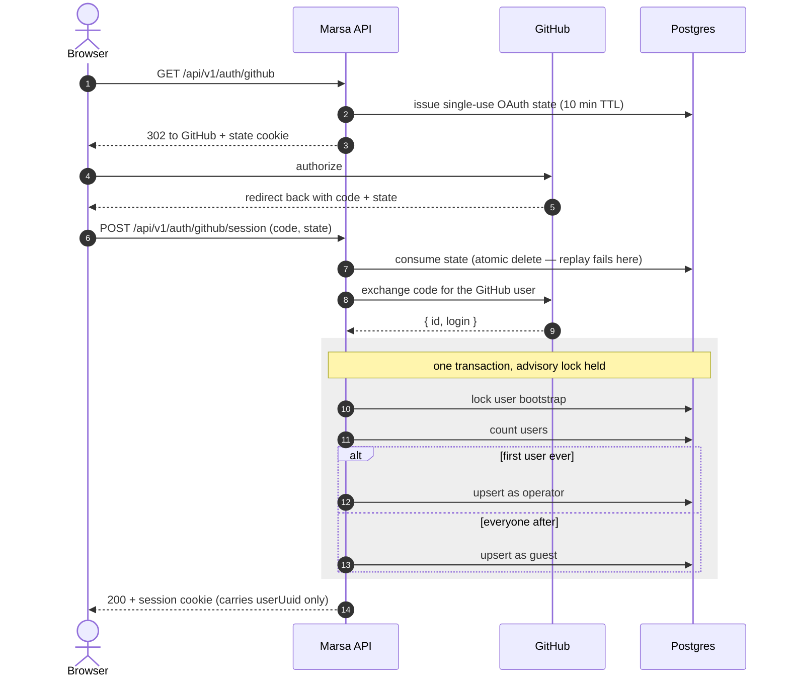
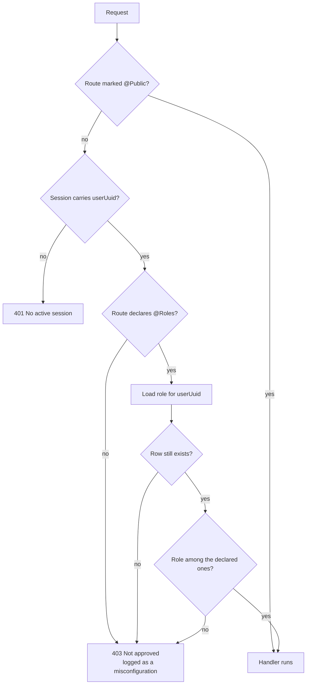

# Authentication and authorization

Every route in Marsa is closed until it says otherwise. Two guards run globally, in this
order, on every request:

1. **Who are you?** — `SessionAuthGuard`. 401 without a session.
2. **Are you allowed?** — `RolesGuard`. 403 unless the route names your role.

A route escapes both by declaring `@Public()`. There is no third state: a route is either
public, or it requires a session **and** names the roles it admits.

## The rule that matters

**A route that declares no roles admits nobody.**

Forgetting to decorate a new endpoint does not leave it open — it leaves it shut, for
everyone, including operators. That is deliberate: a misconfigured route should be a locked
door you trip over on the first request, not a quiet hole you find out about later. The
refusal is logged as a misconfiguration (`… declares no roles and is not @Public`) while the
client still gets the same generic 403 as a real denial.

`AccessControlModule` registers both guards and is imported by `AppModule.forRoot`, not
`AuthModule`, so the gate also covers `TestBench.setupModuleTest`, which boots a single
feature without `AuthModule`. Registration order is load-bearing — `APP_GUARD` providers run
in the order they are listed, and `RolesGuard` assumes a sessionless request has already been
refused. The observable proof is that a gated route answers **401** rather than 403 when no
cookie is present; `roles.guard.e2e.test.ts` asserts exactly that.

## Roles

| Role       | Means                       | Reaches                                            |
| ---------- | --------------------------- | -------------------------------------------------- |
| `operator` | Administers the install     | Everything, including `/v1/users` and role changes |
| `member`   | Approved user               | Everything except the operator-only surface        |
| `guest`    | Signed in, not yet approved | Only `GET /auth/me`                                |

The **first** user row ever created becomes `operator` (under an advisory lock, so two
simultaneous first logins cannot both claim it). Every later sign-in lands on `guest` and
reaches nothing until an operator promotes them.

The role is read from the database **per request**, not stamped into the session cookie, so
a promotion takes effect on the promoted user's next request rather than their next login.

Roles are written out in full at each route rather than hidden behind named sets like
`ANY_APPROVED`. The list stays short (a permissions model is expected to replace roles before
it grows), and an explicit list is data a future migration can translate mechanically, where
a named set is a policy someone has to re-interpret first.

## Decorating a route

```ts
@Get()
@Roles(UserRole.Operator)   // session required, operators only
handle() {}
```

| You want                              | Write                                                        |
| ------------------------------------- | ------------------------------------------------------------ |
| Reachable by anyone, signed in or not | `@Public()`                                                  |
| Any approved user                     | `@Roles(UserRole.Operator, UserRole.Member)`                 |
| Operators only                        | `@Roles(UserRole.Operator)`                                  |
| Reachable by a not-yet-approved user  | `@Roles(UserRole.Operator, UserRole.Member, UserRole.Guest)` |
| Nobody (and you did not mean to)      | nothing — this is the default, and it is a bug               |

The last row is the point of the design. There is no decorator you can forget that quietly
opens a route.

Both decorators go on the **route method, never the controller class**. `RolesGuard` reads
`@Public()` before `@Roles(...)`, and class-level metadata applies to every method in the
class — so a class-level `@Public()` silently beats a method-level `@Roles(...)`, which is the
one way this model can still leak an unauthenticated route. Every route in the codebase is
decorated at the method, and one route per controller makes the class form pointless.

Only `GET /auth/me` admits `guest` today. A guest has to be able to read its own role, or the
dashboard cannot tell them _why_ they are blocked and they just see a wall of 403s. Adding a
second one should need an argument.

`@Public()` means the guard chain does not apply — **not** that the endpoint is unauthenticated
by design. `convert-manifest` consumes a single-use manifest state token, and `capture-installation`
mints an installation token against GitHub — which only succeeds for a real installation of
our App. Those are their real authentication, and both live in the use-case rather than in a
guard.

## Logging in



The session cookie is a `@fastify/secure-session` cookie and carries **only** `userUuid` —
never the role. That is what makes a promotion take effect without a re-login.

## Authorizing a request



There is no implicit default. The allowed set is whatever `@Roles(...)` names, and an absent
or empty list admits nobody.

## Promoting a guest

```text
GET   /api/v1/users            → operators only; everyone who has signed in, with their role
PATCH /api/v1/users/:uuid/role → operators only; sets one user's role
```

Two rules keep an install administrable, and both matter:

- **You cannot change your own role.** The acting operator always survives their own edit.
- **You cannot demote the last operator.** Checked under the same advisory lock the
  first-login bootstrap uses, so two operators demoting each other concurrently cannot both
  succeed — one wins, the other gets a 400.

Without the second rule the first is not enough: both requests pass the self-change check
independently, and an install can end up with zero operators and no recovery path.

## Where the code lives

| Piece                 | Path                                                            |
| --------------------- | --------------------------------------------------------------- |
| Session guard         | `apps/api/src/app/auth/guards/session-auth.guard.ts`            |
| Role gate             | `apps/api/src/app/auth/guards/roles.guard.ts`                   |
| Global registration   | `apps/api/src/app/auth/access-control.module.ts`                |
| `@Roles` / `@Public`  | `apps/api/src/app/auth/decorators/roles.decorator.ts`           |
| Per-request role read | `apps/api/src/app/auth/services/user-role/user-role.service.ts` |
| Session field types   | `apps/api/src/app/auth/auth-session.types.ts`                   |
| Advisory lock keys    | `apps/api/src/modules/database/advisory-locks.ts`               |

Decisions behind this: [AgDR-0004](agdr/AgDR-0004-authentication-and-idp-strategy.md) (why
GitHub OAuth), [AgDR-0016](agdr/AgDR-0016-oauth-seam-and-session-mechanism.md) (why a signed
cookie), [AgDR-0024](agdr/AgDR-0024-migration-user-role-member-value.md) (first-admin
bootstrap).
